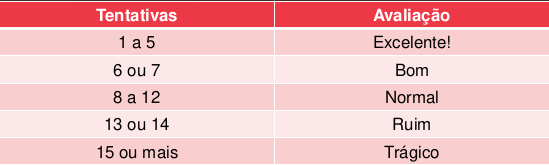

Desafio 2 realizado em aula - Algorítimos e Lógica de Programação. (Professor Nava)

- Faça um programa que jogue contra um humano. 
- O programa conta quantos palpites o jogador precisou até adivinhar um número inteiro sorteado entre 1 e 1000, inclusive, cada vez que o jogador erra, o programa diz quantas tentativas já foram feitas e dá uma dica. 
- A dica informa se o número chutado é maior ou menor que o número sorteado. 
- O jogo vai estreitando o intervalo de números possíveis conforme as tentativas vão sendo feitas. 
- O programa ainda imprime uma avaliação do desempenho do jogador segundo a tabela seguinte:

Veja uma saída para o programa:

Tentativa: 1. Entre um número maior que 0 e menor que 1001: 150
Muito baixo.
Tentativa: 2. Entre um número maior que 150 e menor que 1001: 400
Muito baixo.
Tentativa: 3. Entre um número maior que 400 e menor que 1001: 600
Muito alto.
Tentativa: 4. Entre um número maior que 400 e menor que 600: 500
Muito alto.
Tentativa: 5. Entre um número maior que 400 e menor que 500: 435
Voce acertou o numero 435 em 5 tentativas.
Voce, como adivinhador, eh excelente!